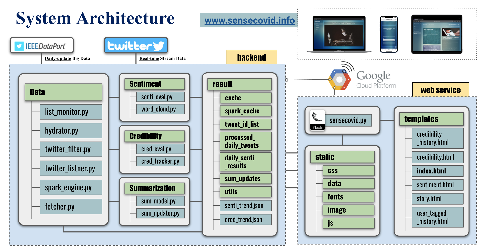

# SENSECOVID: COVID-19 Twitter Analyzer
Welcome to project sensecovid! This is an intelligent online system that can automatically aggregate and summarize valuable information from live streaming tweets around COVID-19 related topics.

**Note:** Please feel free to visit our website via www.sensecovid.info 

## System Architecture Overview

## Environment Preparation

1. #### **Twitter-side setup**

    -  Create a new app at [Twitter Developer Portal](https://developer.twitter.com/en/portal/dashboard) 

    -  Save your **Consumer Keys** and **Authentication Tokens**

2. #### **Server-side setup**

    - **Create a conda virual enviroment**
        - `conda create -n twitter python=3.7`
    - **Install all required packages**
        - `conda activate twitter`
        - `pip install -r requirements.txt`
    - Set up credentials for [twarc](https://github.com/DocNow/twarc) ( **Consumer Keys, etc)**
        - `twarc config`

## Initiate the system

